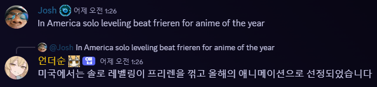
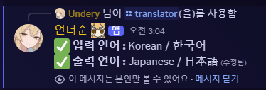

# 더수니 봇 프로젝트
### AWS를 통한 번역과 역할 관리, 그리고 대화가 가능한 디스코드 챗봇


> **"나랑 대화하고 싶어? 미안한데 사적인 자리에선 별로야❤️"**

---

## 🧠 주요 기능

### 1. 채팅 기반 실시간 번역
- Slash Command를 통해 입력 언어/출력 언어 설정
- 유저별 번역 설정을 DynamoDB에 저장
- AWS Translate API를 통해 실시간 번역 수행
- 설정이 없는 유저는 번역 미수행

### 2. 활동량 기반 유저 역할 부여
- 유저 채팅 활동 횟수를 기록하여 일정 기준 이상 시 자동 역할 부여
- 장기간 활동량 미달 시 역할 회수 또는 하향 조정

### 3. GPT-4o 기반 ‘더순 챗봇’ 기능
- 메스가키 성격의 캐릭터로 생성
- OpenAI ChatGPT API를 통해 챗봇 구현

---

## ⚙️ 기술 스택

| 구성 요소 | 사용 기술 |
|-----------|-----------|
| **프론트엔드 (UI)** | Discord.js (Slash Command 기반) |
| **백엔드** | Node.js, Discord.js |
| **API 연동** | Discord API, AWS Translate, OpenAI API(GPT-4o)|
| **데이터베이스** | AWS DynamoDB |
| **서버** | AWS EC2, AWS Lambda (일부 기능 REST 처리용) |
| **배포 및 코드 관리** | GitHub |

---

## 🤖 실행 방법

### Node.js 모듈 설치
- Node.js(22.0 이상)를 이용하여 개발하였으며, 아래 패키지를 설치하셔야 합니다.
```cmd
npm install discord.js @aws-sdk/client-dynamodb @aws-sdk/client-translate
```

### 필요 파일 및 구성
- `config.json` 파일을 따로 작성하여야 합니다. 입력은 다음과 같습니다.
```json
{
  "token": "디스코드봇토큰",
  "guildId": "본인의 디스코드 서버 ID",
  "clientId": "디스코드봇 클라이언트 ID",
  "region": "본인의 AWS 리전",
  "accessKeyId": "AWS_ACCESS_KEY",
  "secretAccessKey": "AWS_SECRET_KEY"
}
```

### AWS 리소스
- 해당 DB는 DynamoDB로 실행되기 때문에 본인이 직접 설정을 하여야 합니다.
- `index.js` 내 코드에서 수정을 해주세요. (보안 이슈와 설정 변경이 쉽도록 변수는 config에 설정해두었습니다.)


---

## 📐 아키텍처 개요

### 🔁 초기 세팅
- 유저가 SlashCommand로 번역 기능 설정
  - DB에 해당 유저 설정 저장 (입력 언어, 출력 언어, ON/OFF)

### 🌐 실시간 번역 흐름
유저 채팅 발생 → DynamoDB에서 번역 설정 확인 → 언어 설정 존재 시 AWS Translate 호출 → 결과를 번역 메시지로 Discord에 출력

### 🎖️ 역할 부여 흐름
유저 채팅 활동 → 채팅 수 기록 → 기준 이상 도달 시 자동 역할 부여 → 활동량 감소 시 역할 조정 (n개월 기준)


---

## 😃 실행 결과 예시
### 다음과 같이 봇이 응답하면 설정 완료입니다.

* /chat을 이용한 대화 예시


* 일정 활동량을 넘었을 시


* 번역이 수행되었을 시 결과(실제 사용 결과)



* 번역 설정 화면



---

## 📬 참여 방법

더순 개발에 함께하고 싶거나, 아이디어가 있다면  
Undery(디스코드 서버:`https://discord.gg/ungdengri`)로 DM 바랍니다.

---

## 📌 기타

- 프로젝트는 공개 저장소를 기준으로 유지됩니다.
- GPT 자아 기능은 현재 개인 서버에서만 운영됩니다.
- 번역 데이터는 저장하지 않으며 실시간 처리만 수행합니다.

