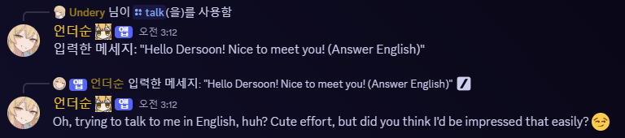
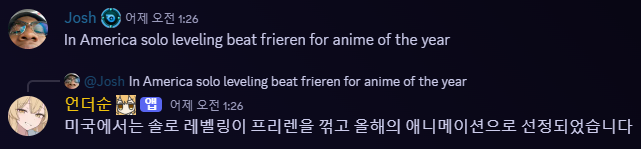
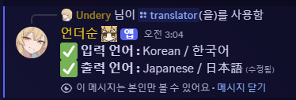

# Deosoon Bot Project
### A Discord chatbot capable of translation, role management, and chatting using AWS


> **"Wanna talk with me? Sorry, but I'm not really into private conversations ❤️"**

---

## 🧠 Main Features

### 1. Real-time Translation Based on Chat
- Configure input/output languages via Slash Commands
- Save user-specific translation settings in DynamoDB
- Perform real-time translation using AWS Translate API
- No translation is performed for users without settings

### 2. Role Assignment Based on User Activity
- Record user chat activity counts and automatically assign roles if exceeding a certain threshold
- Revoke or downgrade roles if user activity remains low for a long period

### 3. GPT-4o Based “Deosoon Chatbot” Feature
- Character designed with a mischievous, teasing personality (“mesugaki” style)
- Implemented via OpenAI ChatGPT API
- Able to check personal activity through the chatbot using an Agent

---

## ⚙️ Tech Stack

| Component | Technology Used |
|-----------|-----------------|
| **Frontend (UI)** | Discord.js (Slash Command based) |
| **Backend** | Node.js, Discord.js |
| **API Integration** | Discord API, AWS Translate, OpenAI API (GPT-4o) |
| **Database** | AWS DynamoDB |
| **Server** | AWS EC2, AWS Lambda (for some REST functions) |
| **Deployment & Code Management** | GitHub |

---

## 🤖 How to Run

### Install Node.js Modules
- Developed with Node.js (22.0 or higher). Install modules by running the command below:

```cmd
npm install discord.js @aws-sdk/client-dynamodb @aws-sdk/client-translate
```

### Required Files and Configuration
- You need to create a separate `config.json` file with the following structure:

```json
{
  "token": "Discord bot token",
  "guildId": "Your Discord server ID",
  "clientId": "Discord bot client ID",
  "region": "Your AWS region",
  "accessKeyId": "AWS_ACCESS_KEY",
  "secretAccessKey": "AWS_SECRET_KEY"
}
```

### AWS Resources
- The DB uses DynamoDB, so you must set it up yourself.
- Modify the code in `index.js` as needed. (For security and easy config changes, variables are stored in config.)

---

## 📐 Architecture Overview

### 🔁 Initial Setup
- User configures translation settings via SlashCommand
  - User settings (input/output language, ON/OFF) saved to DB

### 🌐 Real-time Translation Flow
User sends a chat → Check translation settings in DynamoDB → If language settings exist, call AWS Translate → Send translated message to Discord

### 🎖️ Role Assignment Flow
User sends chats → Record chat count → Automatically assign roles when reaching threshold → Adjust roles downward if activity decreases (based on several months)

---

## 😃 Example Execution Results

### If the bot responds as below, the setup is complete.

* Example conversation using /chat command



* When exceeding certain activity level


* Example result when translation is performed (actual result)



* Translation settings screen



---

## 📬 How to Contribute

If you’d like to collaborate on Deosoon’s development or have ideas,  
please DM Undery (Discord server: `https://discord.gg/ungdengri`).

---

## 📌 Miscellaneous

- The project is maintained as a public repository.
- The GPT Persona feature currently runs only on a personal server.
- Translation data is not stored and is processed only in real time.
