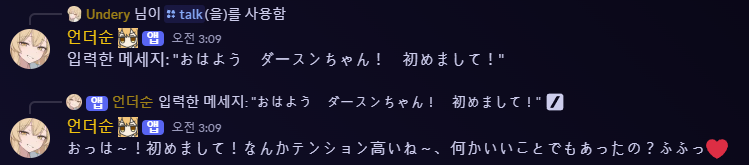

# Deosoon Bot プロジェクト
### AWSを活用した翻訳、役割管理、そして会話ができるDiscordチャットボット


> **「私とおしゃべりしたいの？ごめんね、プライベートな場ではあまり乗り気じゃないの❤️」**

---

## 🧠 主な機能

### 1. チャットベースのリアルタイム翻訳
- Slash Commandで入力言語／出力言語を設定
- ユーザーごとの翻訳設定をDynamoDBに保存
- AWS Translate APIを利用してリアルタイム翻訳を実行
- 設定のないユーザーには翻訳を行わない

### 2. ユーザー活動量に基づく役割付与
- ユーザーのチャット活動回数を記録し、一定基準を超えると自動的に役割を付与
- 長期間活動が少ない場合は役割を剥奪または降格

### 3. GPT-4oベースの「デオスンチャットボット」機能
- 「メスガキ」風の性格でキャラクターを生成
- OpenAI ChatGPT APIを通じてチャットボットを実装
- エージェントを活用して、チャットボット経由で自分の活動を確認可能

---

## ⚙️ 技術スタック

| コンポーネント | 使用技術 |
|---------------|----------|
| **フロントエンド（UI）** | Discord.js (Slash Commandベース) |
| **バックエンド** | Node.js, Discord.js |
| **API連携** | Discord API, AWS Translate, OpenAI API (GPT-4o) |
| **データベース** | AWS DynamoDB |
| **サーバー** | AWS EC2, AWS Lambda（一部REST処理用） |
| **デプロイ・コード管理** | GitHub |

---

## 🤖 実行方法

### Node.jsモジュールのインストール
- Node.js（22.0以上）で開発。以下のコマンドを実行してインストールします。

```cmd
npm install discord.js @aws-sdk/client-dynamodb @aws-sdk/client-translate
```

### 必要ファイルと設定
- `config.json` ファイルを別途作成し、以下のように設定します。

```json
{
  "token": "Discordボットのトークン",
  "guildId": "自分のDiscordサーバーID",
  "clientId": "DiscordボットのクライアントID",
  "region": "自分のAWSリージョン",
  "accessKeyId": "AWS_ACCESS_KEY",
  "secretAccessKey": "AWS_SECRET_KEY"
}
```

### AWSリソース
- このDBはDynamoDBを使用するため、自身で設定が必要です。
- `index.js` 内のコードを修正してください。（セキュリティ対策や設定変更を簡単にするため、変数はconfigにまとめています。）

---

## 📐 アーキテクチャ概要

### 🔁 初期設定
- ユーザーがSlashCommandで翻訳機能を設定
  - 入力言語、出力言語、ON/OFF の設定をDBに保存

### 🌐 リアルタイム翻訳の流れ
ユーザーチャット発生 → DynamoDBで翻訳設定を確認 → 設定があればAWS Translateを呼び出し → Discordに翻訳結果を出力

### 🎖️ 役割付与の流れ
ユーザーチャット → チャット数を記録 → 基準到達で自動役割付与 → 活動減少時は役割を調整（nか月単位）

---

## 😃 実行例

### 以下のようにBotが応答すれば設定完了です。

* /chatを使った会話例



* 一定以上の活動を超えた場合


* 翻訳が実行された際の結果（実際の結果）


* 翻訳設定画面


---

## 📬 参加方法

Deosoonの開発に参加したい方や、アイデアがある方は  
Undery（Discordサーバー: `https://discord.gg/ungdengri`）へDMください。

---

## 📌 その他

- プロジェクトは公開リポジトリとして運用されます。
- GPT自我機能は現在個人サーバーのみで稼働しています。
- 翻訳データは保存されず、リアルタイムで処理されます。
